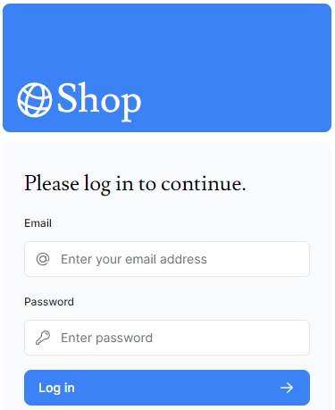
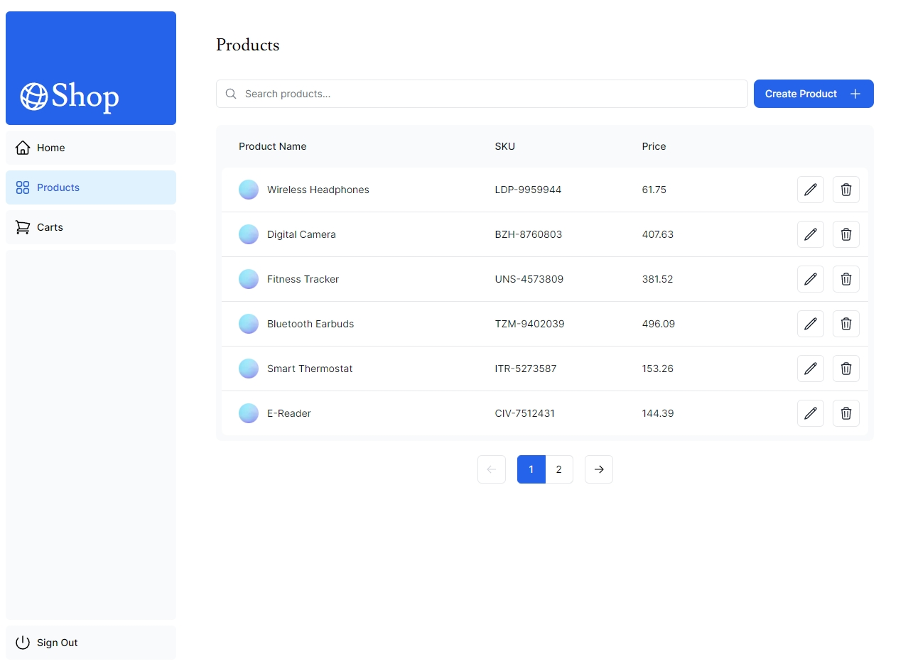

# Next.js Frontend for NetValue Shop

## Overview

This frontend application is developed using the Next.js framework, focusing on user interaction and management features. It includes user authentication, product CRUD operations for admins, product listing, cart management, and more. Authentication is handled using Next-Auth.

## Key Features

-   User authentication (login/logout) with Next-Auth.
-   CRUD operations on products by administrators.
-   Product listing for customers.
-   Adding products to the shopping cart.
-   Shopping cart checkout interface (static).
-   Admin view for shopping carts.

## Technology Stack

-   **Framework**: Next.js
-   **Authentication**: Next-Auth
-   **State Management**: [Add if any, e.g., Redux, Context API]
-   **Styling**: [Add if any, e.g., CSS, Sass, Styled Components]
-   **API Interaction**: Axios or Fetch API (for backend communication)

## Installation

Follow these steps to set up the project:

1. Clone the repository:
   git clone https://github.com/Heshan-Qiu/netvalue-shop-frontend.git

2. Install dependencies:
   npm install

3. Configure environment variables:

-   Set up the necessary API endpoints and authentication configurations in a `.env.local` file.
    -   AUTH_SECRET=
    -   AUTH_URL=
    -   NEXT_PUBLIC_API_URL=
    -   NEXT_PUBLIC_API_KEY=

4. Run the development server:
   npm run dev

## Running the Application

-   Navigate to the application in a web browser at `http://localhost:3000` (or your configured port).
-   Log in as either a customer or an administrator to access different functionalities.

## Usage

-   **User Authentication**: Use the login/logout feature to access user-specific functionalities.
-   **Admin Panel**: Accessible to admin users for managing products.
-   **Product Listing**: Browse through the list of products.
-   **Cart Management**: Add products to the cart and proceed to checkout.
-   **Checkout Interface**: Review selected products in the shopping cart (Note: This is a static interface as of the current version).
-   **Admin Cart View**: Admins can view details of shopping carts.

## Contact

For any queries or contributions, feel free to contact me at heshan.chiu@gmail.com or open an issue in this repository.

## Screenshots

### User Login Page

### Customer Product Tiled Layout View

### Admin Product Management

### Shopping Cart

